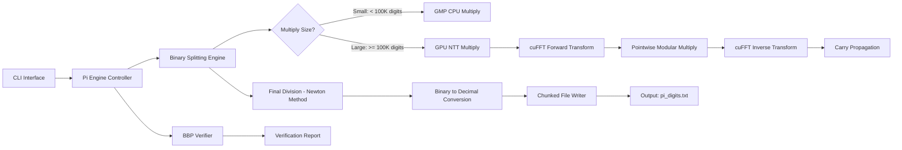
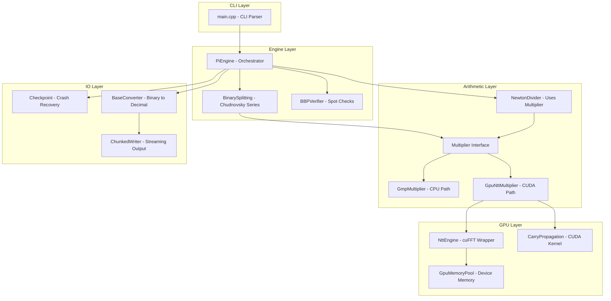
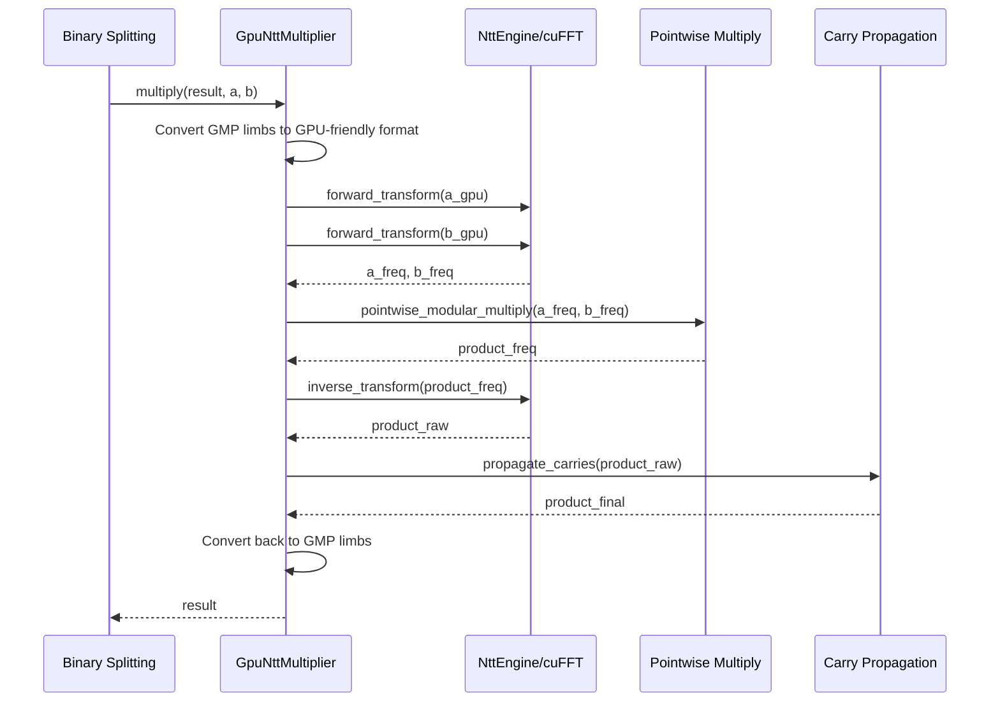

# Pi Computation Engine — System Architecture & Implementation Plan

## Decision Summary

| Decision | Choice | Rationale |
|----------|--------|-----------|
| Algorithm | Chudnovsky + Binary Splitting | Fastest convergence, industry standard |
| Language | C++ with CUDA | Performance + GPU acceleration |
| CPU Arithmetic | GMP (libgmp) | 30+ years of optimization, unbeatable |
| GPU Multiplication | cuFFT-based NTT | NVIDIA-optimized, focus on architecture not kernels |
| Local Dev | macOS Apple Silicon | Algorithm dev, CPU-only testing |
| GPU Execution | NVIDIA GPU (cloud/remote) | CUDA runtime target |
| Target Scale | 10M–100M+ digits | Meaningful GPU benefit territory |
| Build System | CMake | Cross-platform, CUDA-aware |

---

## System Architecture

### High-Level Data Flow



### Component Architecture



---

## Directory Structure

```
pi/
├── CMakeLists.txt                  # Top-level CMake
├── .env                            # Build configuration
├── README.md
├── plans/
│   ├── pi-computation-research.md  # Research document
│   └── architecture.md             # This file
├── memory-bank/
│   ├── projectbrief.md
│   ├── activeContext.md
│   ├── progress.md
│   ├── systemPatterns.md
│   ├── techContext.md
│   ├── memories.md
│   └── lessons-learned.md
├── src/
│   ├── CMakeLists.txt
│   ├── main.cpp                    # CLI entry point
│   ├── engine/
│   │   ├── CMakeLists.txt
│   │   ├── pi_engine.h             # Orchestrator
│   │   ├── pi_engine.cpp
│   │   ├── binary_splitting.h      # Chudnovsky + binary splitting
│   │   ├── binary_splitting.cpp
│   │   ├── bbp_verifier.h          # BBP spot-check verification
│   │   └── bbp_verifier.cpp
│   ├── arithmetic/
│   │   ├── CMakeLists.txt
│   │   ├── multiplier.h            # Abstract multiplier interface
│   │   ├── gmp_multiplier.h        # CPU path via GMP
│   │   ├── gmp_multiplier.cpp
│   │   ├── gpu_ntt_multiplier.h    # GPU path via cuFFT
│   │   ├── gpu_ntt_multiplier.cpp
│   │   ├── newton_divider.h        # Division via Newton iteration
│   │   └── newton_divider.cpp
│   ├── gpu/
│   │   ├── CMakeLists.txt
│   │   ├── ntt_engine.h            # cuFFT-based NTT wrapper
│   │   ├── ntt_engine.cu           # CUDA implementation
│   │   ├── carry_propagation.h     # Carry propagation kernel
│   │   ├── carry_propagation.cu    # CUDA kernel
│   │   ├── pointwise_multiply.h    # Modular pointwise multiply
│   │   ├── pointwise_multiply.cu   # CUDA kernel
│   │   └── gpu_memory_pool.h       # Device memory management
│   └── io/
│       ├── CMakeLists.txt
│       ├── chunked_writer.h        # Streaming digit output
│       ├── chunked_writer.cpp
│       ├── checkpoint.h            # Crash recovery state
│       ├── checkpoint.cpp
│       ├── base_converter.h        # Binary-to-decimal conversion
│       └── base_converter.cpp
├── tests/
│   ├── CMakeLists.txt
│   ├── test_gmp_multiplier.cpp     # Multiply/square correctness
│   ├── test_binary_splitting.cpp   # Per-term and merged P/Q/R correctness
│   ├── test_newton_divider.cpp     # Division accuracy at various precisions
│   ├── test_base_converter.cpp     # Binary-to-decimal conversion
│   ├── test_chunked_writer.cpp     # Output format and chunking
│   ├── test_pi_engine.cpp          # Integration: compute N digits, verify
│   ├── test_ntt_engine.cpp         # NTT round-trip verification (GPU)
│   ├── test_pointwise_multiply.cpp # Frequency-domain multiply (GPU)
│   ├── test_carry_propagation.cpp  # Carry correctness (GPU)
│   ├── test_gpu_ntt_multiplier.cpp # GPU vs CPU multiply comparison
│   ├── test_bbp_verifier.cpp       # BBP formula spot-checks
│   ├── test_checkpoint.cpp         # Save/restore state correctness
│   ├── test_validation.cpp         # Compare output against reference pi digits
│   └── data/
│       ├── pi_1000.txt             # First 1,000 digits (checked into git)
│       ├── pi_10000.txt            # First 10,000 digits (checked into git)
│       ├── pi_1000000.txt          # First 1,000,000 digits (~1MB, in git)
│       ├── pi_checksums.json       # SHA-256 checksums for various digit counts
│       └── fetch_reference.py      # Download larger refs from pi.delivery
├── benchmarks/
│   ├── CMakeLists.txt
│   ├── bench_multiply.cpp          # CPU vs GPU multiply at various sizes
│   ├── bench_ntt.cpp               # NTT transform benchmarks
│   └── bench_pi.cpp                # Full pi computation benchmarks
└── scripts/
    ├── verify_digits.py            # Compare output against known pi digits
    ├── benchmark_plot.py           # Visualize benchmark results
    └── setup_cloud_gpu.sh          # Helper to set up NVIDIA cloud instance
```

---

## Key Design Decisions

### 1. Multiplier Interface (Strategy Pattern)

```cpp
// multiplier.h - Abstract interface
class Multiplier {
public:
    virtual ~Multiplier = default;

    // Multiply two GMP integers, result = a * b
    virtual void multiply(mpz_t result, const mpz_t a, const mpz_t b) = 0;

    // Squared: result = a * a (can be optimized)
    virtual void square(mpz_t result, const mpz_t a) = 0;
};
```

The `PiEngine` selects `GmpMultiplier` or `GpuNttMultiplier` based on:
- Whether CUDA is available at runtime
- The size of the operands (GPU only wins for large multiplies)
- A configurable threshold (default: ~100K digits)

This means the **same binary splitting code** works on your Mac (CPU-only) and on the NVIDIA machine (GPU-accelerated) without any changes.

### 2. GPU NTT Multiplication Flow



**Key detail**: We use cuFFT with **double-precision complex** transforms, then apply modular reduction. For numbers beyond ~10^15 digits, you'd need to split into multiple convolutions to avoid floating-point precision loss, but for our target range (up to ~100M digits), a single double-precision FFT convolution per multiply is sufficient with careful choice of base.

### 3. Binary Splitting for Chudnovsky

The Chudnovsky formula:

```
1/pi = 12 * sum_{k=0}^{inf} (-1)^k * (6k)! * (13591409 + 545140134*k) / ((3k)! * (k!)^3 * 640320^(3k+3/2))
```

Binary splitting converts this into computing three sequences P(a,b), Q(a,b), R(a,b) recursively:

```
For the range [a, b):
    if b - a == 1:
        P(a,b) = -(6a-5)(2a-1)(6a-1)
        Q(a,b) = 10939058860032000 * a^3
        R(a,b) = P(a,b) * (13591409 + 545140134*a)
    else:
        m = (a+b) / 2
        P(a,b) = P(a,m) * P(m,b)
        Q(a,b) = Q(a,m) * Q(m,b)
        R(a,b) = Q(m,b) * R(a,m) + P(a,m) * R(m,b)

Then: pi = Q(0,N) * 426880 * sqrt(10005) / (13591409 * Q(0,N) + R(0,N))
```

The **large multiplications** happen in the combine step (P*P, Q*Q, Q*R, P*R) — this is where GPU acceleration kicks in.

### 4. Number Representation on GPU

GMP stores numbers as arrays of `mp_limb_t` (64-bit unsigned integers). For GPU NTT:

1. **Unpack** GMP limbs into an array of smaller digits (e.g., base 2^24 or base 10^9)
2. **Pad** to power-of-2 length for FFT
3. **Transfer** to GPU device memory
4. **NTT multiply** via cuFFT
5. **Carry propagate** on GPU
6. **Transfer** back and **repack** into GMP limbs

The base choice (2^24 recommended) ensures that products of two digits fit in double-precision float without precision loss: 2^24 * 2^24 = 2^48, well within the 53-bit mantissa of IEEE 754 double.

### 5. Streaming Output & Checkpointing

For millions of digits, the final result is a single giant GMP integer. Converting to decimal and writing to file:

1. **Base conversion**: Use GMP's `mpz_get_str()` for moderate sizes, or a divide-and-conquer base conversion for very large numbers
2. **Chunked writing**: Write 1M digits at a time to `pi_digits.txt`
3. **Checkpointing**: After each level of the binary splitting tree completes, serialize the intermediate P, Q, R values to disk. On crash recovery, resume from the last checkpoint.

---

## Build & Platform Strategy

### Local Development (macOS Apple Silicon)
```
# CPU-only build — no CUDA required
cmake -B build -DENABLE_CUDA=OFF
cmake --build build
./build/pi_compute --digits 1000000 --verify
```

### GPU Build (NVIDIA machine)
```
# Full build with CUDA
cmake -B build -DENABLE_CUDA=ON
cmake --build build
./build/pi_compute --digits 100000000 --gpu --verify
```

### Dependencies
| Dependency | Purpose | Install |
|-----------|---------|---------|
| GMP >= 6.2 | Arbitrary-precision integers | `brew install gmp` / `apt install libgmp-dev` |
| CUDA Toolkit >= 11.0 | GPU compute + cuFFT | NVIDIA installer (GPU machine only) |
| Google Test | Unit testing | Fetched via CMake FetchContent |
| Google Benchmark | Performance benchmarks | Fetched via CMake FetchContent |

---

## Test-Driven Development Strategy

Every component is built **test-first**. The cycle for each component:
1. **Write a failing test** that defines the expected behavior
2. **Implement the minimum code** to make the test pass
3. **Refactor** for clarity and performance
4. **Add edge case tests** and regression tests

### Test Pyramid

```mermaid
graph TB
    subgraph Unit Tests - Fast, Isolated
        UT1[GmpMultiplier: multiply known values]
        UT2[BinarySplitting: single term P/Q/R values]
        UT3[BinarySplitting: small range merge correctness]
        UT4[NewtonDivider: division of known quotients]
        UT5[BaseConverter: binary to decimal for known values]
        UT6[NTT round-trip: transform then inverse = identity]
        UT7[Carry propagation: known overflow patterns]
        UT8[ChunkedWriter: output format and chunking]
    end

    subgraph Integration Tests - Component Interactions
        IT1[GpuNttMultiplier vs GmpMultiplier: same results]
        IT2[BinarySplitting + Multiplier: first 100 digits correct]
        IT3[Full pipeline: compute 1000 digits, verify all]
        IT4[Checkpoint save/restore: resume produces same result]
    end

    subgraph Validation Tests - Against Public Pi Digits
        VT1[First 100 digits match hardcoded known value]
        VT2[First 10,000 digits match reference file]
        VT3[First 1,000,000 digits match public dataset]
        VT4[BBP spot-checks at positions 1K, 10K, 100K, 1M]
        VT5[SHA-256 checksum of first N digits matches published checksums]
    end
```

### Public Pi Digit Validation Sources

| Source | Digits Available | Format | URL / Method |
|--------|-----------------|--------|--------------|
| **pi.delivery** | 50 trillion | API + bulk download | `https://pi.delivery` — REST API for any digit range |
| **y-cruncher verification files** | Various | Checksums | Published SHA-256 hashes for 10K, 100K, 1M, 10M, 100M, 1B digits |
| **Project Gutenberg** | 1 million | Text file | Classic reference file, widely mirrored |
| **Hardcoded in tests** | 1,000 | String literal | First 1000 digits embedded directly in test code |
| **mpmath computation** | Any (slow) | Python | `mpmath.mp.dps = N; str(mpmath.pi)` — independent verification |

### Validation Strategy by Scale

| Digit Count | Validation Method |
|-------------|-------------------|
| 1 – 1,000 | Hardcoded string comparison in unit test |
| 1,000 – 10,000 | Compare against bundled reference file `tests/data/pi_10000.txt` |
| 10,000 – 1,000,000 | Compare against bundled reference file `tests/data/pi_1000000.txt` |
| 1M – 10M | Download from pi.delivery API and compare; also SHA-256 checksum |
| 10M+ | SHA-256 checksum comparison against y-cruncher published values + BBP spot-checks |

### Reference Data Files

```
tests/
├── data/
│   ├── pi_1000.txt          # First 1000 digits (hardcoded, checked into git)
│   ├── pi_10000.txt          # First 10,000 digits (checked into git)
│   ├── pi_1000000.txt        # First 1,000,000 digits (checked into git, ~1MB)
│   ├── pi_checksums.json     # SHA-256 checksums for various digit counts
│   └── fetch_reference.py    # Script to download larger reference files from pi.delivery
```

### Test Execution

```bash
# Run all unit tests (fast, no GPU needed)
ctest --test-dir build -L unit

# Run integration tests (may need GPU for GPU-path tests)
ctest --test-dir build -L integration

# Run validation tests (compares against reference pi digits)
ctest --test-dir build -L validation

# Run everything
ctest --test-dir build
```

---

## Implementation Phases (TDD)

### Phase 1: Foundation — CPU-Only Pi Engine
**Goal**: Compute 1M digits correctly using Chudnovsky + binary splitting + GMP
**Approach**: Test-first for every component

- [ ] Set up CMake project with GMP, Google Test, Google Benchmark via FetchContent
- [ ] Create reference data files: `pi_1000.txt`, `pi_10000.txt`, `pi_1000000.txt`
- [ ] Create `fetch_reference.py` script to download digits from pi.delivery API
- [ ] **TDD: GmpMultiplier**
  - [ ] Write test: multiply two known large numbers, assert product
  - [ ] Write test: square a known number, assert result
  - [ ] Implement `Multiplier` interface and `GmpMultiplier`
- [ ] **TDD: BinarySplitting**
  - [ ] Write test: single-term P(0,1), Q(0,1), R(0,1) match hand-calculated values
  - [ ] Write test: two-term merge P(0,2), Q(0,2), R(0,2) match hand-calculated values
  - [ ] Write test: compute pi to 100 digits, compare against hardcoded string
  - [ ] Implement `BinarySplitting` with Chudnovsky formula
- [ ] **TDD: NewtonDivider**
  - [ ] Write test: divide known numerator/denominator, assert quotient to N digits
  - [ ] Write test: division precision matches GMP's mpf_div for various sizes
  - [ ] Implement `NewtonDivider` using iterative multiplication
- [ ] **TDD: BaseConverter**
  - [ ] Write test: convert known binary GMP integer to decimal string
  - [ ] Write test: conversion matches GMP's mpz_get_str for various sizes
  - [ ] Implement `BaseConverter`
- [ ] **TDD: ChunkedWriter**
  - [ ] Write test: write 10,000 digits in chunks of 1,000, verify file content
  - [ ] Write test: output file matches expected format (no extra whitespace, etc.)
  - [ ] Implement `ChunkedWriter`
- [ ] **TDD: PiEngine (integration)**
  - [ ] Write test: compute 1,000 digits, compare against `pi_1000.txt`
  - [ ] Write test: compute 10,000 digits, compare against `pi_10000.txt`
  - [ ] Implement `PiEngine` orchestrator
- [ ] **Validation: 1M digits**
  - [ ] Write test: compute 1,000,000 digits, compare against `pi_1000000.txt`
  - [ ] Write test: SHA-256 of output matches published checksum
- [ ] Benchmark: time to compute 1K, 10K, 100K, 1M, 5M, 10M digits on CPU

### Phase 2: GPU Acceleration — cuFFT NTT Multiply
**Goal**: Accelerate large multiplications on NVIDIA GPU
**Approach**: Test GPU results against known-good CPU results at every step

- [ ] **TDD: NttEngine**
  - [ ] Write test: forward then inverse NTT of known array = original array (round-trip)
  - [ ] Write test: NTT of zero array = zero array
  - [ ] Write test: NTT of single-element array = identity
  - [ ] Implement `NttEngine` wrapping cuFFT
- [ ] **TDD: Pointwise Multiply Kernel**
  - [ ] Write test: pointwise multiply of known frequency-domain arrays matches expected
  - [ ] Implement `pointwise_multiply` CUDA kernel
- [ ] **TDD: Carry Propagation Kernel**
  - [ ] Write test: propagate carries on array with known overflows, assert result
  - [ ] Write test: no-carry case (all digits within base) passes through unchanged
  - [ ] Implement `carry_propagation` CUDA kernel
- [ ] **TDD: GpuNttMultiplier**
  - [ ] Write test: GPU multiply of two 1000-digit numbers matches GMP result exactly
  - [ ] Write test: GPU multiply of two 100,000-digit numbers matches GMP result exactly
  - [ ] Write test: GPU multiply of two 1,000,000-digit numbers matches GMP result exactly
  - [ ] Implement `GpuNttMultiplier` with GMP limb conversion
- [ ] **TDD: GpuMemoryPool**
  - [ ] Write test: allocate, use, return, reallocate — no leaks
  - [ ] Implement `GpuMemoryPool`
- [ ] **TDD: Adaptive Threshold**
  - [ ] Write test: small operands use CPU path, large operands use GPU path
  - [ ] Implement threshold selection in `PiEngine`
- [ ] **Validation: GPU end-to-end**
  - [ ] Write test: compute 1M digits with GPU, compare against `pi_1000000.txt`
  - [ ] Write test: compute 10M digits with GPU, compare SHA-256 against published checksum
- [ ] Benchmark: GPU multiply vs CPU multiply at 10K, 100K, 1M, 10M digit operands

### Phase 3: Optimization & Scale
**Goal**: Push to 100M+ digits, optimize throughput

- [ ] **TDD: Checkpoint**
  - [ ] Write test: save state, load state, resumed computation matches non-interrupted
  - [ ] Implement checkpointing for crash recovery
- [ ] Optimize GPU memory transfers (pinned memory, async streams)
- [ ] Implement overlapped computation: next binary splitting level while GPU multiplies
- [ ] Profile with NVIDIA Nsight to find bottlenecks
- [ ] Implement multi-GPU support (if available) for independent multiplications
- [ ] **Validation: large scale**
  - [ ] Compute 50M digits, verify SHA-256 checksum
  - [ ] Compute 100M digits, verify SHA-256 checksum + BBP spot-checks
- [ ] Benchmark at 50M, 100M, 500M digits
- [ ] Compare performance against y-cruncher at same digit counts

### Phase 4: Verification & Polish
**Goal**: Prove correctness with multiple independent methods

- [ ] **TDD: BBPVerifier**
  - [ ] Write test: BBP formula at position 0 matches known hex digits of pi
  - [ ] Write test: BBP at position 1000 matches known hex digits
  - [ ] Write test: BBP at position 1,000,000 matches known hex digits
  - [ ] Implement `BBPVerifier`
- [ ] Add progress bar with ETA (digits computed, time remaining)
- [ ] Add `--verify` flag that runs BBP checks at random positions post-computation
- [ ] Create `scripts/benchmark_plot.py` for visualization
- [ ] Write comprehensive README with usage, architecture, benchmarks
- [ ] **Final validation suite**: Run all digit counts (1K through max) and verify all checksums

---

## CLI Interface Design

```
pi_compute - High-performance pi digit calculator

USAGE:
    pi_compute [OPTIONS] --digits <N>

OPTIONS:
    --digits <N>        Number of decimal digits to compute (required)
    --gpu               Enable GPU acceleration (requires CUDA)
    --gpu-threshold <N> Minimum digit count for GPU multiply (default: 100000)
    --output <FILE>     Output file path (default: pi_digits.txt)
    --verify            Run BBP verification after computation
    --verify-count <N>  Number of BBP spot-checks (default: 10)
    --checkpoint-dir <DIR>  Directory for crash recovery checkpoints
    --resume            Resume from last checkpoint
    --benchmark         Run in benchmark mode (timing only, no output)
    --verbose           Verbose progress output
    --help              Show this help message

EXAMPLES:
    # Compute 1 million digits on CPU
    pi_compute --digits 1000000

    # Compute 100 million digits with GPU acceleration
    pi_compute --digits 100000000 --gpu --verify

    # Resume interrupted computation
    pi_compute --digits 100000000 --gpu --resume --checkpoint-dir ./checkpoints
```

---

## Performance Expectations

| Digits | CPU-Only (est.) | GPU-Accelerated (est.) | Notes |
|--------|----------------|----------------------|-------|
| 1M | ~2-5 seconds | ~2-5 seconds | Too small for GPU benefit |
| 10M | ~30-90 seconds | ~15-40 seconds | GPU starts helping |
| 100M | ~15-45 minutes | ~5-15 minutes | Clear GPU advantage |
| 1B | ~5-15 hours | ~1.5-5 hours | Significant GPU win |

*Estimates based on modern hardware. Actual times depend on specific CPU/GPU models.*

---

## Risk Mitigation

| Risk | Mitigation |
|------|-----------|
| cuFFT precision loss at very large sizes | Use base 2^24 to keep products within double-precision mantissa; split convolutions if needed |
| GPU memory limits for huge numbers | Implement tiled NTT that processes chunks; fall back to CPU for numbers exceeding GPU RAM |
| GMP limb format ↔ GPU format conversion overhead | Use pinned memory for fast transfers; batch conversions |
| Correctness bugs in binary splitting | Extensive unit tests; compare against mpmath at every stage |
| macOS dev without CUDA | Clean CPU/GPU separation via Multiplier interface; all algorithm code testable on Mac |
